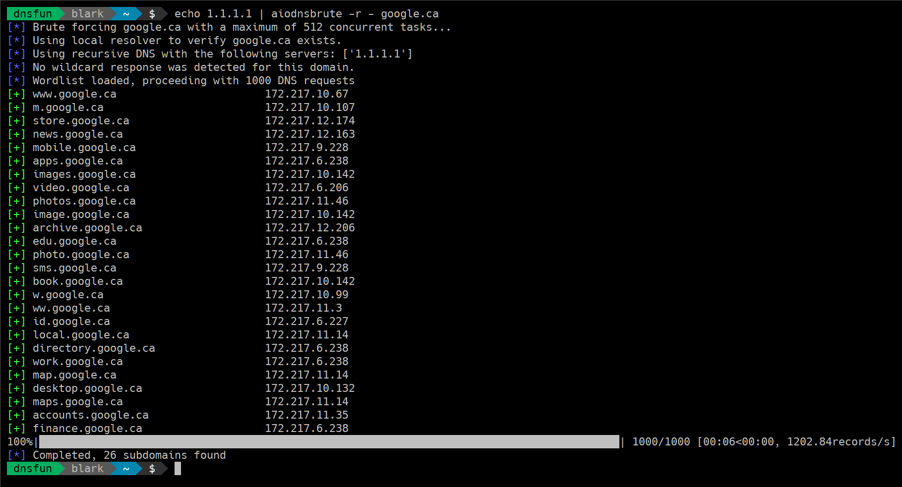

# Async DNS Brute

A Python 3.5+ tool that uses asyncio to brute force domain names asynchronously.

## Speed

*It's fast.* Benchmarks on small VPS hosts put around 100k DNS resoultions at 1.5-2mins. An amazon M3 box was used to make 1 mil requests in just over 3 minutes. Your mileage may vary. It's probably best to avoid using Google's resolvers if you're purely interested in speed.

**DISCLAIMER**
- Your ISP's and home router's DNS servers probably _suck_. Stick to a VPS with fast resolvers (or set up your own) if you're after speed.
- **WARNING** This tool is capable of sending LARGE amounts of DNS traffic. I am not repsonsible if you DoS someone's DNS servers.

# Installation

If you don't use `pipsi`, you're missing out.
Here are [installation instructions](https://github.com/mitsuhiko/pipsi#readme).

## Debian/Kali/Ubuntu

The following should get you up and running.

    $ sudo apt-get install python3-pip
    $ sudo pip3 install virtualenv
    $ curl https://raw.githubusercontent.com/mitsuhiko/pipsi/master/get-pipsi.py | python3

NOTE: pipsi installs each package into `~/.local/venvs/PKGNAME` and then symlinks all new scripts into `~/.local/bin`
so add `~/.local/bin` to your .bashrc and then `source .bashrc`

    $ git clone https://github.com/blark/aiodnsbrute.git
    $ cd aiodnsbrute
    $ pipsi install .

## Alternate install

Alternately you can install the usual way:

    $ git clone https://github.com/blark/aiodnsbrute.git
    $ cd aiodnsbrute
    $ python setup.py install .

## Usage

Get help:

    $ aiodnsbrute --help

    Usage: cli.py [OPTIONS] DOMAIN

      Brute force DNS domain names asynchronously

    Options:
      -w, --wordlist TEXT           Wordlist to use for brute force.
      -t, --max-tasks INTEGER       Maximum number of tasks to run asynchronosly.
      -r, --resolver-file FILENAME  A text file containing a list of DNS resolvers
                                    to use, one per line, comments start with #.
                                    Default: use system resolvers
      -v, --verbosity               Increase output verbosity
      -o, --output [csv|json|off]   Output results to DOMAIN.csv/json (extension
                                    automatically appended when not using -f).
      -f, --outfile FILENAME        Output filename. Use '-' to
                                    send output to stdout overriding normal
                                    output.
      --wildcard / --no-wildcard    Wildcard detection, enabled by default
      --help                        Show this message and exit.

### Examples

Run a brute force with some custom options:

    $ aiodnsbrute -w wordlist.txt -vv -t 1024 domain.com

Run a brute force, supppess normal output and send only JSON to stdout:

    $ aiodnbrute -f - -o json domain.com

Wildcard detection enabled by default (--no-wildcard turns it off):

    $ aiodnsbrute foo.com

    [*] Brute forcing foo.com with a maximum of 512 concurrent tasks...
    [*] Using recursive DNS with the following servers: ['50.116.53.5', '50.116.58.5', '50.116.61.5']
    [!] Wildcard response detected, ignoring answers containing ['23.23.86.44']
    [*] Wordlist loaded, proceeding with 1000 DNS requests
    [+] www.foo.com                         52.73.176.251, 52.4.225.20
    100%|██████████████████████████████████████████████████████████████████████████████| 1000/1000 [00:05<00:00, 140.18records/s]
    [*] Completed, 1 subdomains found

Supply a list of resolvers from file (ignoring blank lines and starting with #), specify `-r -` to read list from stdin.

    $ aiodnsbrute -r resolvers.txt domain.com

## Thanks

- The wordlists are from [bitquark's](https://github.com/bitquark) [dnspop](https://github.com/bitquark/dnspop) repo.
- Creds to [Sublist3r](https://github.com/aboul3la/Sublist3r) for pointing me there.

## Notes

- You might want to do a `ulimit -n` to see how many open files are allowed. You can also increase that number using the same command, i.e. `ulimit -n <2048>`
